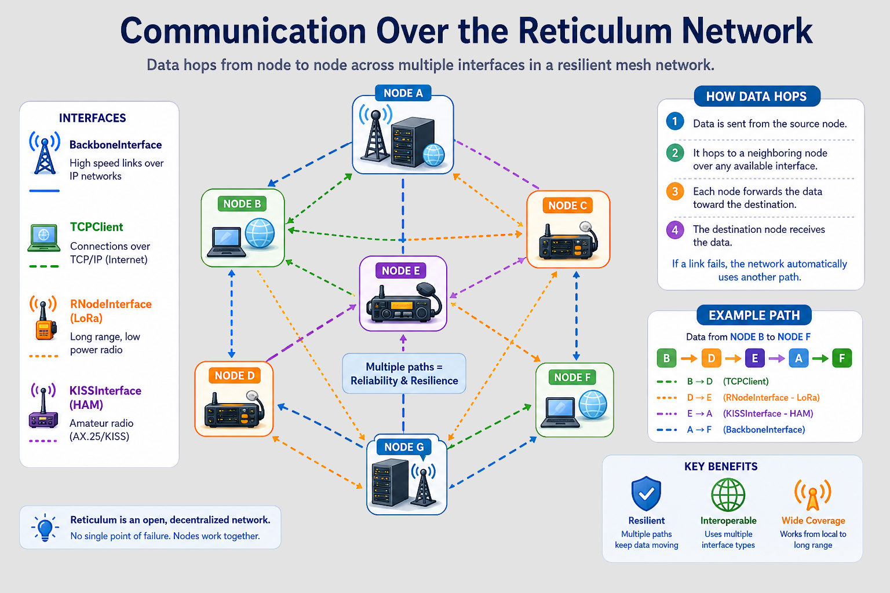

# Reticulum Router Daemon


A pure, rust-based transport for the Reticulum network based largely on [reticulum-sdk](https://github.com/GhostMeshLabs/reticulum-sdk)

## What is Reticulum?

Reticulum is a mesh network protocol, originally developed by [Mark Qvist in Python](https://github.com/markqvist/Reticulum). Reticulum nodes transport packets across a sea of instances of varying, indeterminate physical medias.



## Components

### Transport daemon

* `reticulum-router` - Transport Daemon
  * A fast transport daemon for all your Reticulum transport / routing needs

### Utilities

> All tools will prefer using a local running `reticulum-router` instance via the enable_rpc service ports
> However, `rnsh` will fallback to connecting to the Reticulum network directly (based on the standard configuration file) preventing the need to deploy reticulum-router on all endpoints.

* `rnid` - Identity Management
  * Manage your local Reticulum identities
* `rnpath` - Network Path Queries
  * Ask the network for a path to a Reticulum destination
* `rnperf` - Reticulum bandwidth tester (like iperf, but over the mesh)
  * Client / Server to test real-world link bandwidth between two points on the network.
* `rnsh` - Shell over Reticulum (like ssh, but over the mesh)
  * Shell service for the Reticulum network. Listens for connections over Reticulum, or initiate connections to remote rnsh destinations
* `rnpage` - NomadNet page server
  * Announces and serves documents such as [Micron](https://github.com/RFnexus/micron-parser-js) pages over Reticulum
* `rnmcp` - MCP connector for the RPC control port
  * Probably a horrific idea

## Implemented protocol features

* ✅ rnstransport path.request
* ✅ rnstransport probe (aka respond_to_probes)
* ✅ rnstransport discovery (aka discoverable)
* ❌ rnstransport remote.management (aka enable_remote_management)
* ✅ blackhole list sourcing (aka blackhole_sources)
* ✅ info blackhole (aka publish_blackhole)

## Implemented interfaces

> Physical communication interfaces implemented

### IP Network (LAN, WAN)

* ❌ AutoInterface
* ✅ BackboneInterface
* ❌ I2PInterface
* ✅ TCPClientInterface
* ✅ TCPServerInterface (bind_host ::1 will allow dual-stack functionality)
* ✅ UDPInterface

### Radio (HAM, LoRA)

* ❌ AX25KISSInterface
* ✅ [Modem73Interface](https://github.com/RFnexus/modem73)
* ✅ [RNodeInterface](https://unsigned.io/rnode/) (over Serial)
* ✅ LoRaInterface (over SPI, SX126X or LR1121)
* ❌ RNodeMultiInterface
* ❌ KISSInterface

### Other

* ❌ BluetoothInterface
* ❌ PipeInterface
* ❌ SerialInterface

# Configuring

The Reticulum Router Daemon will automatically convert any existing non-standard Python rnsd configurations to standard toml config files.

## Differences from rnsd configuration

* toml
  * The config file is actually standard toml. reticulum-router will attempt to convert any
    existing non-standard Python rnsd config files to compatible toml (creating a new config
    called config.toml)
* toml location
  * We search ~/.reticulum for compatibility, then fall-back to a more standard ~/.config/reticulum
    config path.
* interfaces / discovery_name
  * Omitted. We just use interface name
* interfaces / reachable_on
  * We *DO* optionally want a port number, because sometimes things are behind load balancers
  * Does *NOT* accept a local script to execute to get your IP
    * (in the future, we want to detect your external IP if reachable_on is omitted)
* The shared_instance language has been replaced by "enable_rpc"
  * The old shared_instance language should still work as expected though
  * Added rpc_bind_host. It is not recommended to share the RPC onto a public
    network, however listening outside of the host may be helpful in some debugging situations.

## Example syntax

```toml
[reticulum]
enable_transport = true
enable_rpc = true
rpc_bind_host = "127.0.0.1"
rpc_data_port = 37428
rpc_control_port = 37429
rpc_key = "somethingsecretmatchingpythonrnsd"
instance_name = "default"
respond_to_probes = true

[logging]
loglevel = 5

[metrics]
enabled = false
bind_host = "127.0.0.1"
bind_port = 9090
collection_interval_seconds = 5
collection_timeout_seconds = 3
request_timeout_seconds = 2

[[interfaces]]
name = "Default Interface"
type = "AutoInterface"
enabled = false

[[interfaces]]
name = "Local"
type = "BackboneInterface"
mode = "boundary"
enabled = true
bind_host = "0.0.0.0"
bind_port = 4242
discoverable = true
reachable_on = "cool.server.com:4242"

[[interfaces]]
name = "Modem73"
type = "Modem73Interface"
mode = "internal"
enabled = false
target_host = "127.0.0.1"
target_port = 8001
control_host = "127.0.0.1"
control_port = 8073

[[interfaces]]
name = "LoRa via SPI"
type = "LoRaInterface"
mode = "internal"
enabled = true
chipset = "SX1262"
spi_path = "/dev/spidev0.0"
frequency = 914875000
bandwidth = 125000.0
txpower = 14
spreadingfactor = 12
codingrate = 5

[[interfaces]]
name = "GhostMesh 👻 ATX (IPv4,IPv6,LoRA)"
type = "TCPClientInterface"
mode = "boundary"
enabled = true
target_host = "rns.atx.ghostmesh.net"
target_port = 4242
```

## Log verbosity

All tools and daemons support the RUST_LOG environment variable to set the log verbosity

```RUST_LOG=trace rnsh ...```

### Log Levels

* error -- Only critical errors
* warn -- All of the above and non-critical events
* info -- All of the above and informational events
* debug -- All of the above and debugging information
* trace -- All of the above and traces of every packet

## What LoRA frequency should I use?

We have done some math, and come up with the following recommendations. They may shift as
more real-world data is collected.

> Why do these values differ from Meshtastic / Meshcore?
> Because Reticulum is a global network. We are not forwarding a few text messages
> in a small geograpgic area. Reticulum is "worldwide" meaning announcements consume
> a large percentage of available air time if we go for "maximum range" settings.

### United States

> All of these settings remain below the 400ms "dwell time".

Frequency: 914.875 Mhz.  Gives distance to lower-frequency Meshtastic / Meshcore.

| Name            | Bitrate    | Bandwidth      | Spreading Factor  | Coding Rate            | Notes                           |
|-----------------|------------|----------------|-------------------|------------------------|---------------------------------|
| Turbo / Short   | 21.8 Kbps  | 500 kHz        | 7                 | 4/5  (5)               | Maximum speed, shortest range. Won't like interference. Older RNode firmwares might have issues|
| Fast / Medimum  | 10.9 Kbps  | 250 kHz        | 7                 | 4/5  (5)               | Fast, medium range.  Compromise on range for faster speed|
| Average / Long  | 6.2 Kbps   | 250 kHz        | 8                 | 4/5  (5)               | Good balance of range and speed. Recommended|
| Slow / Long     | 1.7 Kbps   | 125 kHz        | 9                 | 4/5  (5)               | Slow, maximum range and interference rejection. Announcements will cut into available bitrate|

### Europe

> All of these settings reming below the EU duty cycle of 10%

Frequency: 869.431 Mhz.

| Name            | Bitrate    | Bandwidth      | Spreading Factor  | Coding Rate            | Notes                           |
|-----------------|------------|----------------|-------------------|------------------------|---------------------------------|
| Fast / Medium   | 3.3 Kbps   | 125 kHz        | 8                 | 4/5  (5)               | Recommended. 10% Duty Cycle limit|
| Slow / Long     | 1.1 Kbps   | 62.5 kHz       | 8                 | 4/7  (7)               | Narrower bandwidth for noise rejection. Longer range in urban environments|
| Slow / Long     | 0.879 Kbps | 62.5 kHz       | 9                 | 4/5  (5)               | Narrower bandwidth for maximum noise rejection / range in urban environments. Announcements will cut into available bitrate|

# Installing

## Compiling Source Code

```
$ git clone https://github.com/ReticulaLabs/reticulum-router.git && cd reticulum-router
$ cargo build --release
```

## Container deployment

> Linux, Alpine based x86_64 and aarch64 containers are available

```
docker pull ghcr.io/reticulalabs/reticulum-router:v1.9.10
docker run -v reticulum_data:/root/.config/reticulum ghcr.io/reticulalabs/reticulum-router:v1.9.10
```

/root/.config/reticulum will contain the following files:

  * identity - Node identity
  * config.toml - Example basic node configuration

# Metrics

reticulum-router optionally offers a standard Prometheus /metrics endpoint to give insights to
witnessed Reticulum network activity


# Projects implemented over Reticulum

* [Nomad Network](https://unsigned.io/software/Nomad_Network.html) - A smol web based on lightweight web pages run over Reticulum
* [MeshChatX](https://meshchatx.com) - A desktop all-in-one client supporting Chat, VoIP, and Nomad Network over Reticulum
* [Columba](https://columba.network) - An Android, all-in-one client supporting Chat and VoIP

# Projects exploring the Reticulum network

* [RNS Map and Reliability Tracker](https://rns.fyi)
* [RMAP](https://rmap.world)
